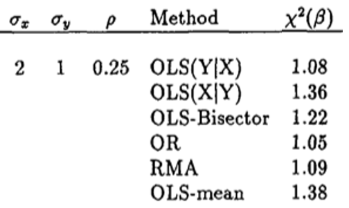
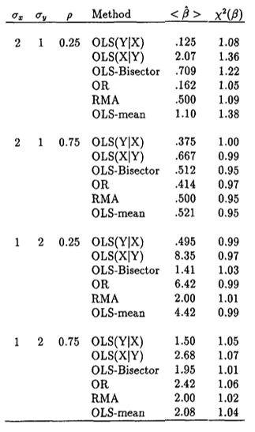
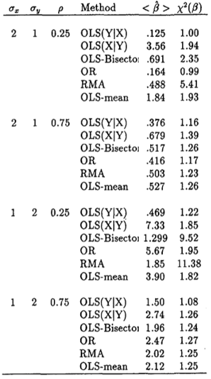

```{r, warning = FALSE, message = FALSE, echo = FALSE}
library(dplyr)
library(MASS)
library(kableExtra)
```

</br>

## Introduction

There had been a long controversy of the best linear fit line to
bivariate data. In the study of "Analytic and Monte Carlo Comparisons of
Six Different Linear Least Squares Fits (1992)," Babu and Feigelson
compared six different linear regression methods and figured out which
method would best estimate the relationship between bivariate variables
x and y. Those six methods are OLS(X\|Y), the standard ordinary least
squares line, OLS(Y\|X), the inverse regression line, OLS-bisector,
which bisects the angle formed by the two OLS lines, OR, orthogonal
regression, RMA, reduced major axis, OLS-mean\*\*, whose slope is the
arithmetic mean of the two OLS slope.

They calculated the slope of each method ($\beta_i$) by using the
parameters - standard deviation of x and y, correlation, and the sign of
correlation (see the Formula 1). They also calculated the slopes based
on the generated data ($\hat{\beta_i}$) (see the Formula 2) and compared
them. Finally, they calculated $\chi^2_i$ based on the $\beta_i$ and
$\hat{\beta_i}$ to figure out which method is the best estimator for the
relationship between bivariate variables.

## Methods

### Data-generating model

In the article, they generated either 50 or 500 bivariate data of x and
y with five parameters - standard deviation of x and y, correlation
between x and y, and the mean of x and y. The mean values of x and y
were both zero, so the actual parameters for the data-generating model
were four.

The data-generating procedure is below.

```{r}
generate_data <- function(N, sd_x, sd_y, r){
  # `mvrnorm` requires covariance matrix 
  cov <- r * sd_x * sd_y
  data <- mvrnorm(n = N, mu = c(0, 0), Sigma = matrix(c(sd_x^2, cov, cov, sd_y^2), 
                                                      nrow = 2), empirical=TRUE)
  sim_data <- data.frame(data)
  return(sim_data)
}
```

Checking the data-generation function

```{r}
# Example with n = 500, mean of x = 2, mean of y = 1, correlation between x and y = 0.25
check_data <- generate_data(500, 2, 1, 0.25)
```

```{r}
check_data %>%
  summarise(mux = mean(X1),
            sdx = sd(X1),
            muy = mean(X2),
            sdy = sd(X2),
            cor = cor(X1, X2)
            ) %>%
  kbl(caption = "Summary of generated data", booktabs = TRUE) %>%
  kable_styling(latex_options = "HOLD_position")
```

</br>

Two bivariate data (X1, X2) are successfully generated. The result shows
the standard deviation of x and y (2 & 1), correlation, 0.25, and mean
of zero.

### Procedures

As mentioned above, they calculated the slopes based on both of the
parameters and the generated data. The formula are below.

$OLS(Y|X)~~\beta_1 = \rho~\sigma_y/\sigma_x$

</br>

$OLS(X|Y)~~\beta_2 = \sigma_y/\rho~\sigma_x$

</br>

$OLS-bisector~~\beta_3 = \frac{\rho}{1+\rho^2}\{\frac{\sigma_y^2 - \sigma_x^2}{\sigma_x\sigma_y}+[(\frac{\sigma_x}{\sigma_y})^2+\rho^2+\rho^{-2}+(\frac{\sigma_y}{\sigma_x})^2]^{1/2}\}$

</br>

$OR~~\beta_4=\frac{1}{2\rho\sigma_x\sigma_y}\{\sigma^2_y-\sigma^2_x+\left[(\sigma^2_y-\sigma^2_x)^2+4\rho^2\sigma_x^2\sigma_y^2\right]^{1/2}\}$

</br>

$RMA~~\beta_5=\frac{\sigma_y}{\sigma_x}sign(\rho)$

</br>

$OLS-mean~~\beta_6=\frac{1}{2}(\beta_1+\beta_2)=\frac{1}{2}(\rho+\rho^{-1})\sigma_y/\sigma_x$

$\\$

[Formula 1. The formula of slope with parameters (Babu & Feigelson,
1992)]

$\\$

$OLS(Y|X)~~\hat{\beta}_1=S_{xy}/S_{xx}$

</br>

$OLS(X|Y)~~\hat{\beta}_2=S_{yy}/S_{xy}$

</br>

$OLS-bisector~~\hat{\beta}_3=(\hat{\beta}_1+\hat{\beta}_2)^{-1}[\hat{\beta}_1\hat{\beta}_2-1+[(1+\hat{\beta}_1^2)(1+\hat{\beta}_2^2)]^{\frac{1}{2}}]$

</br>

$OR~~\hat{\beta}_4=\frac{1}{2}[(\hat{\beta}_2-\hat{\beta}_1^{-1})+sign(S_{xy})[4+(\hat{\beta}_2-\hat{\beta}_1^{-1})^2]^{\frac{1}{2}}]$

</br>

$RMA~~\hat{\beta}_5=sign(S_{xy})(\hat{\beta}_1\hat{\beta}_2)^{\frac{1}{2}}$

</br>

$OLS-mean~~\hat{\beta}_6=\frac{1}{2}(\hat{\beta}_1+\hat{\beta}_2)$

$\\$

[Formula 2. The formula of slope based on the generated data (Babu &
Feigelson, 1992)]

$\\$

Calculate the predicted slopes from the formula above (Formula 2)

```{r}
# Define x and y
x <- check_data[,1]
y <- check_data[,2]

# Calculate the predicted slopes 
slope_sols <- sum( (x - mean(x))*(y - mean(y)) ) / sum( (x - mean(x))^2 )
slope_iols <- sum( (y - mean(y))^2 ) / sum( (x - mean(x))*(y - mean(y)) )
slope_olsbi <- (slope_sols + slope_iols)^(-1) * (slope_sols*slope_iols -1 
                        + ((1 + slope_sols^2) * (1 + slope_iols^2))^(1/2))
slope_or <- 1/2 * ((slope_iols - slope_sols^(-1)) 
                   + sign(sum((x-mean(x))*(y - mean(y))))
                   *(4+(slope_iols-slope_sols^(-1))^2)^(1/2))
slope_rma <- sign(sum((x - mean(x))*(y - mean(y)))) * (slope_sols*slope_iols)^(1/2)
slope_ols_mean <- 1/2 * (slope_sols + slope_iols)

# saving results
regs <- data.frame(slope_sols = slope_sols,
                   slope_iols = slope_iols, 
                   slope_olsbi = slope_olsbi,
                   slope_or = slope_or,
                   slope_rma = slope_rma,
                   slope_ols_mean = slope_ols_mean)
```

The results of predicted slope are below.

```{r}
regs %>%
  round(., digits = 3) %>%
  kbl(caption = "Predicted Slopes", booktabs = TRUE) %>%
  kable_styling(latex_options = "HOLD_position")
```

</br>

{width="251"}

</br>

</br>

The predicted slopes with a set of parameter ($\sigma_x = 2$,
$\sigma_y = 1$, and $\rho = 0.25$) of SOLS (OLS(Y\|X)) 0.125, IOLS
(OLS(X\|Y)) 2, OLSBI 0.7075, OR 0.1622, RMA 0.5, OLS-mean 1.062 are
successfully replicated.

### Performance criteria

To figure out which linear method was the most accurate, they calculated
a $\chi^2(\beta_i)$ for each method. They compared the population slopes
$\beta_i$ and the predicted slopes $\hat{\beta}_i$ of each linear method
and calculated the $\chi^2(\beta_i)$ by using the formula below. The
more $\chi^2(\beta_i)$ approaches to 1, the more accurate the method is.

</br>

$$
\chi^2(\beta_i) =  \frac{1}{M}\sum_{j=1}^{M}(\hat{\beta}_{ij} - \beta_i)^2/\hat{Var(\hat{\beta}_i)}
$$

[Formula 3. The formula of chi-square (Babu & Feigelson, 1992)]

$\\$

The procedure of calculating $\chi^2(\beta_i)$ with 500 simulations is
below.

```{r}
# Parameter
cr <- 0.25
sd_x <- 2
sd_y <- 1

# computing population slopes
slope_sols_par <- cr * sd_y / sd_x
slope_iols_par <- sd_y/cr/sd_x
slope_olsbi_par <- cr/(1+cr^2)*((sd_y^2 - sd_x^2)/sd_x/sd_y 
                                + ((sd_x/sd_y)^2 + cr^2 + cr^(-2) + (sd_y/sd_x)^2)^(0.5))
slope_or_par <- 1/2/cr/sd_x/sd_y * (sd_y^2 - sd_x^2 + 
                                      ((sd_y^2 - sd_x^2)^2 + 4*cr^2*sd_x^2*sd_y^2)^0.5)
slope_rma_par <- sd_y/sd_x
slope_ols_mean_par <- 1/2 * (cr + cr^(-1)) * sd_y / sd_x

# Calculate the predicted slopes with 500 simulation
reg_matrix <- data.frame()
reg_results <- data.frame()
chi_results <- data.frame()

for(i in 1:500){
  regs <- data.frame()
  data <- generate_data(500, 2, 1, 0.25)
  x <- data[,1]
  x <- jitter(x)
  y <- data[,2]
  y <- jitter(y)
  cr_g <- cor(x,y)

  # The formula of predicted slopes
  slope_sols <- sum((x - mean(x))*(y - mean(y))) / sum((x - mean(x))^2)
  slope_iols <- sum((y - mean(y))^2) / sum((x - mean(x))*(y - mean(y)))
  slope_olsbi <- (slope_sols + slope_iols)^(-1) * (slope_sols*slope_iols -1 
                        + ((1 + slope_sols^2) * (1 + slope_iols^2))^(1/2))
  slope_or <- 1/2 * ((slope_iols - slope_sols^(-1)) + 
            sign(sum((x-mean(x))*(y-mean(y))))*(4+(slope_iols - slope_sols^(-1))^2)^(1/2))
  slope_rma <- sign(sum((x - mean(x))*(y - mean(y)))) * (slope_sols*slope_iols)^(1/2)
  slope_ols_mean <- 1/2 * (slope_sols + slope_iols)
  
  # save the results of predicted slopes
  regs <- data.frame(slope_sols = slope_sols,
                     slope_iols = slope_iols, 
                     slope_olsbi = slope_olsbi,
                     slope_or = slope_or,
                     slope_rma = slope_rma,
                     slope_ols_mean = slope_ols_mean)
  
  reg_matrix <- rbind(reg_matrix, regs)
}

# calculate chi-squares
slope_sols_chi <- mean((reg_matrix$slope_sols - slope_sols_par)^2) / var(reg_matrix$slope_sols)
slope_iols_chi <- sum((reg_matrix$slope_iols - slope_iols_par)^2)/500 / var(reg_matrix$slope_iols)
slope_olsbi_chi <- sum((reg_matrix$slope_olsbi - slope_olsbi_par)^2)/500 / var(reg_matrix$slope_olsbi)
slope_or_chi <- sum((reg_matrix$slope_or - slope_or_par)^2)/500 / var(reg_matrix$slope_or)
slope_rma_chi <- sum((reg_matrix$slope_rma - slope_rma_par)^2)/500 / var(reg_matrix$slope_rma)
slope_ols_mean_chi <- sum((reg_matrix$slope_ols_mean - slope_ols_mean_par)^2)/500 / var(reg_matrix$slope_ols_mean)
chi <- data.frame(slope_sols_chi, slope_iols_chi, slope_olsbi_chi, slope_or_chi, slope_rma_chi, slope_ols_mean_chi)

# save the results
chi_results <- rbind(chi_results, chi)
chi_results %>%
  kbl(caption = "Chi-squares", booktabs = TRUE, table.attr = "style='width:50%;'") %>%
  kable_styling(latex_options = "HOLD_position")
```

</br>

{width="251"}

</br>

We can observe the unexpected discrepancies between generated
chi-squares and the chi-squares from the article. Those discrepancies
may undermine the replication of the study. We will discuss these
discrepancies in discussion section.

### Experimental design

The code that expresses the design.

```{r}
LR <- function(N, par_sdx, par_sdy, par_rho){
  n <- length(eval(parse(text = par_sdx)))
  cr <- numeric(n)
  sd_x <- numeric(N)
  sd_y <- numeric(N)
  slope_sols <- numeric(N)
  slope_iols <- numeric(N)
  slope_olsbi <- numeric(N)
  slope_or <- numeric(N)
  slope_rma <- numeric(N)
  slope_ols_mean <- numeric(N)
  reg_results <- data.frame()
  chi_results <- data.frame()
  
  for(j in 1:n){
    reg_matrix <- data.frame()
    chi <- data.frame()
    
    sd_x <- eval(parse(text = par_sdx))[j]
    sd_y <- eval(parse(text = par_sdy))[j]
    cr <- eval(parse(text = par_rho))[j]
    
    # computing slopes with parameters
    slope_sols_par <- cr * sd_y / sd_x
    slope_iols_par <- sd_y/cr/sd_x
    slope_olsbi_par <- cr/(1+cr^2)*((sd_y^2 - sd_x^2)/sd_x/sd_y + ((sd_x/sd_y)^2 
                                             + cr^2 + cr^(-2) +(sd_y/sd_x)^2)^(0.5))
    slope_or_par <- 1/2/cr/sd_x/sd_y * (sd_y^2 - sd_x^2 + ((sd_y^2 - sd_x^2)^2 
                                                           + 4*cr^2*sd_x^2*sd_y^2)^0.5)
    slope_rma_par <- sd_y/sd_x
    slope_ols_mean_par <- 1/2 * (cr + cr^(-1)) * sd_y / sd_x
    
    for(i in 1:N){
        regs <- data.frame()
        
        # generate data
        r <- cr *2
        data <- mvrnorm(n=N, mu=c(0, 0), Sigma = matrix(c(sd_x^2, r, r, sd_y^2), nrow=2), 
                        empirical=TRUE)
        x <- data[,1]
        x <- jitter(x)
        y <- data[,2]
        y <- jitter(y)
        cr_g <- cor(x,y)

        # compute slopes with generated data
        sdx <- sd(x)
        sdy <- sd(y)
        
        # calculating slopes for six regression models
        slope_sols <- sum((x - mean(x))*(y - mean(y))) / sum((x - mean(x))^2)
        slope_iols <- sum((y - mean(y))^2) / sum((x - mean(x))*(y - mean(y)))
        slope_olsbi <- (slope_sols + slope_iols)^(-1) * (slope_sols*slope_iols -1 
                                 + ((1 + slope_sols^2) * (1 + slope_iols^2))^(1/2))
        slope_or <- 1/2 * ((slope_iols - slope_sols^(-1)) 
            + sign(sum((x - mean(x))*(y - mean(y)))) * (4 + (slope_iols - slope_sols^(-1))^2)^(1/2))
        slope_rma <- sign(sum((x - mean(x))*(y - mean(y)))) * (slope_sols*slope_iols)^(1/2)
        slope_ols_mean <- 1/2 * (slope_sols + slope_iols)

        # save the variances & slopes with generated data
        regs <- data.frame(par_sdx = sd_x,
                           par_sdy = sd_y,
                           par_cr = cr,
                           slope_sols = slope_sols,
                           slope_iols = slope_iols, 
                           slope_olsbi = slope_olsbi,
                           slope_or = slope_or,
                           slope_rma = slope_rma,
                           slope_ols_mean = slope_ols_mean)
        
        reg_matrix <- rbind(reg_matrix, regs)
    }
    
    # chi-squares
    slope_sols_chi <- mean((reg_matrix$slope_sols - slope_sols_par)^2) / var(reg_matrix$slope_sols)
    slope_iols_chi <- sum((reg_matrix$slope_iols - slope_iols_par)^2)/500 / var(reg_matrix$slope_iols)
    slope_olsbi_chi <- sum((reg_matrix$slope_olsbi - slope_olsbi_par)^2)/500 / var(reg_matrix$slope_olsbi)
    slope_or_chi <- sum((reg_matrix$slope_or - slope_or_par)^2)/500 / var(reg_matrix$slope_or)
    slope_rma_chi <- sum((reg_matrix$slope_rma - slope_rma_par)^2)/500 / var(reg_matrix$slope_rma)
    slope_ols_mean_chi <- sum((reg_matrix$slope_ols_mean - slope_ols_mean_par)^2)/500 / var(reg_matrix$slope_ols_mean)
    chi <- data.frame(slope_sols_chi, slope_iols_chi, slope_olsbi_chi, slope_or_chi, slope_rma_chi, slope_ols_mean_chi)
    
    # save results
    reg_results <- rbind(reg_results, data.frame(matrix(unlist(lapply(reg_matrix, mean)), nrow = 1)))
    chi_results <- rbind(chi_results, chi)
  }
  names(reg_results) <- c("par_sdx", "par_sdy", "par_cr", 
                      "slope_sols", "slope_iols", "slope_olsbi", 
                      "slope_or", "slope_rma", "slope_ols_mean")
  results <- cbind(reg_results, chi_results)
  results
}
```

## Results

Results with 500 simulations are below.

```{r}
sdx_par <- c(2,2,1,1)
sdy_par <- c(1,1,2,2)
rho_par <- c(0.25, 0.75, 0.25, 0.75)

LR(500, "sdx_par", "sdy_par", "rho_par") %>%
  kbl(caption = "500 Simulations", booktabs = TRUE) %>%
  kable_styling(latex_options = c("striped", "HOLD_position", "scale_down"))
```

</br>

{width="251"}

</br>

Results with 50 simulations are below.

```{r}
sdx_par <- c(2,2,1,1)
sdy_par <- c(1,1,2,2)
rho_par <- c(0.25, 0.75, 0.25, 0.75)

LR(50, "sdx_par", "sdy_par", "rho_par") %>%
    kbl(caption = "50 Simulations", booktabs = TRUE) %>%
  kable_styling(latex_options = c("striped", "HOLD_position", "scale_down"))
```

</br>

{width="251"}

</br>

The results of 500 simulations show that iols_chi (inverse OLS(X\|Y))
consistently has worse reliability than sols_chi (standard OLS(Y\|X)) in
achieving its theoretical slope. Babu and Feigelson explained that "it
is due to occasional simulated datasets, where the inverse regression
has a nearly vertical slope" (544). However, different from the article,
it is not worse than olsbi (OLS-bisector) and ols_mean (OLS-mean slope).
OR lines and OLS-mean slope are generally low accurate just like the
results in the article but are not the "least" accurate. As Babu and
Feigelson mention in their article that OLS-mean slope is directly
influenced by its linear dependence on the inverse OLS(X\|Y) slope
(544), the chi-squares of those two slopes show very similar amounts,
however, as mentioned above, the accuracy was not successfully
replicated.

The results from 50 simulations show that the performances of all
regression estimates are less accurate than the results from larger
sample size (n = 500) as Babu and Feigelson observed in their article.
OLS-mean slope is the worst accuracy and RMA slopes have the highest
accuracy. What I observe from the replication is that when the
correlation coefficient is low, the accuracy difference between the
methods are bigger - the same pattern was observed in the article (546).

## Discussion

This report is not the entirely successful replication of the study. The
chi-square differences between methods are too small to be
distinguished, and it was relatively hard to estimate which linear
method is the best fit line in predicting the relationship between x and
y. One of the possible reasons can be found from the data generating
process. Since `mvrnorm` function generates too accurate random numbers
which produce the exactly same slopes to the population slopes, which
are based on the parameter. As a result, I need to use `jitter` to add
more error in each variable. However, during this adding-more-error
process, some unexpected deviations can be produced. So for the future
study, it is recommended that more valid data generating function should
be used for the successful replication.

\newpage

## References

Babu & Feigelson. "Analytical and Monte Carlo Comparisons of Six
Different Linear Least Squares Fits." Communications in statistics.
Simulation and computation 21.2 (1992): 533--549. Web
